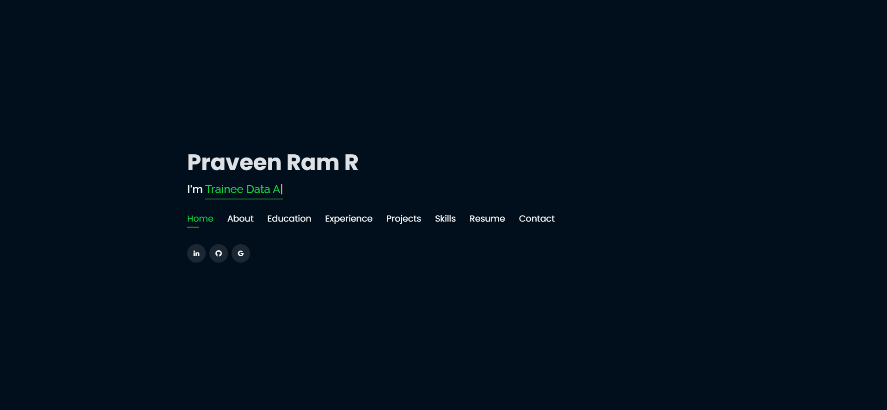

# Portfolio Website

Welcome to my portfolio website! This project showcases my skills, projects, and experiences in web development. It serves as an online resume and portfolio, providing an overview of my work and background.

 <!-- Replace with an actual screenshot link -->

## Features

- **Responsive Design:** Optimized for various devices and screen sizes.
- **Modern UI/UX:** Clean and intuitive design for an excellent user experience.
- **Project Showcase:** Display of selected projects with descriptions and links.
- **Contact Form:** Allows visitors to get in touch with me directly from the website.
- **Social Media Integration:** Links to professional profiles on LinkedIn, GitHub, etc.

## Technologies Used

- **HTML5 & CSS3:** For structuring and styling the website.
- **JavaScript:** For interactive elements and functionality.
- **Bootstrap:** For responsive design and layout.
- **FontAwesome:** For icons and visual enhancements.

## Installation

To run this project locally, follow these steps:

1. **Clone the repository:**
   ```bash
   git clone https://github.com/PraveenRamR/PortfolioWebsite.git
   ```
2. **Navigate to the project directory:**
   ```bash
   cd PortfolioWebsite
   ```
3. **Open `index.html` in your preferred browser:**
   ```bash
   open index.html
   ```

## Usage

Feel free to customize this template to suit your needs. Update the content in the HTML files and adjust the styling in the CSS files. You can also add new projects, modify the contact form settings, and personalize the design as desired.

## Contributing

Contributions are welcome! If you have any suggestions or improvements, please fork the repository and create a pull request. You can also open an issue to report bugs or request new features.

## License

This project is licensed under the MIT License. See the [LICENSE](LICENSE) file for details.

## Contact

If you have any questions or would like to collaborate, feel free to reach out to me:

- **Email:** your.email@example.com
- **LinkedIn:** [Your LinkedIn Profile](https://www.linkedin.com/in/praveen-ram-r)
- **GitHub:** [Your GitHub Profile](https://github.com/PraveenRamR)

Thank you for visiting my portfolio website!
